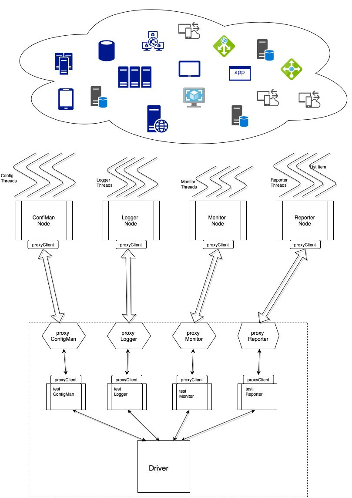

## **Henosis**

`A multi-agent framework for automated testing of distributed applications.`
### **Description**:

Henosis disassemble testCases into smaller chunks per nature of test/validation, configuration, log collection, result verification and monitoring and assembles relevant results at same time through its multi-agent based distributed architecture.

Brings substantial benefits in terms of test-execution time and efficacy.

##### **_Legacy/conventional test-execution:_**

##### _Test Execution with Henosis:_

### Features:

* Test Framework for cloud/cloud-like applications, which are highly distributed and heterogenous in nature

* Simplify each testCase for configuration, log-collection, application/system monitoring and reporting(validation checks).

* Each configuration can include multiple configuration deltas, each executed in parallel across multiple end-points.

* logs can be collected across control and data plane with each respective testcase.

* System and application level resource monitoring can be done with each respective testcase.

* End result verification / reporting can also be done via multiple end-points. 

### **Architecture**:

Driver is the core of Hermes framework, here testCases in xml format is consumed.
Driver divides individual testCases into separate chunks and sends them to hermesNodes i.e. 

a. Test configuration(s) for respective test case is sent to ConfigMan: 

            Upon receiving its chunk (per testCase) for test configuration, It launches multiple threads depending on configuration to be done on one multiple nodes/pods/hosts/applications.
            Each thread's execution result is consolidation and communicated to Driver via proxy Process running with Driver node.

b. Log(s) collection request respective test case is sent to Logger : 
           
            Upon receiving its chunk (per testCase) for collecting logs with upon test configuration and uptil result validation is completed

c. Monitoring request(s) with respective test case is sent to Monitor:
        
            Upon receiving its chunk, it may collect details of system/app resource(cpu, memory, disk, network any system/app parameter) usage across the time-span of test-execution.

d. Report (end-result) requests with respective test case is sent to Reporter

            Upon receiving its chunk, it collects results across multiple end-points.

### Requirements:

* All Hermes Driver and HermesNode must be executed with debian/ubuntu linux with python2.7.18
* All development was done with python2.7.18 (core libraries), No external library/modules is required.

### **How to define testCase:**
testCase(s), must be in a zip format, to be placed in 'tmp/' folder as:

        $ /tmp/testSuite.zip
        $ unzip testSuite.zip
        $ ls 
        testSuite.xml
        testCase-1.xml	
        testCase-1-Config-1.json
        testCase-1-Config-2.json
        testCase-1-Config-3.sh
        
        $cat testSuite.xml
        <?xml version="1.0"?>
        <testSuite>
        <testSuite-Name>test0</testSuite-Name>
        <testSuite-Version>1.0</testSuite-Version>
        <testSuite-tag>pre-prod</testSuite-tag>
        <testSuite-Type>Sanity</testSuite-Type>
        <testSuite-testBed>TB001</testSuite-testBed>
        <testSuite-Developer>realm01user01@gmail.com</testSuite-Developer>
        <testSuite-People>realm01user01@gmail.com,msingh.mx4@gmail.com</testSuite-People>
        <testSuite-Notify>realm01user01@gmail.com,msingh.mx4@gmail.com</testSuite-Notify>
        <testSuite-healthCheck-Hermes>False</testSuite-healthCheck-Hermes>
        <testSuite-healthCheck-testBed>False</testSuite-healthCheck-testBed>
        <testCases>
            <testCase-1>testCase-1.xml</testCase-1>
        </testCases>
        </testSuite>

        So, we have testCase-1 here as a template, more can be added with testSuite.xml. But, each test-Case must have corresponding testCase files as what is described here with testCase-1.xml

        $ cat testCase-1.xml
        <?xml version="1.0"?>
        <testCase-1>
        <testCase-Name>testCase1</testCase-Name>
        <testCase-tag>checkAPI</testCase-tag>
        <testCase-Developer>realm01user01@gmail.com</testCase-Developer>
        <testCase-People>realm01user01@gmail.com</testCase-People>
        <testCase-DevTimeStamp>100920201105</testCase-DevTimeStamp>
        <testCase-FailureNotify>realm01user01@gmail.com</testCase-FailureNotify>
        <testCase-SuccessNotify>realm01user01@gmail.com</testCase-SuccessNotify>
        <testCase-Config>
            <testCase-Config-01>
                <config-Name>cname1</config-Name>
                <config-Tag>cname1</config-Tag>
                <Host>10.0.0.251</Host>
                <Port>8080</Port>
                <Protocol>http</Protocol>
                <URI>/admin/v1/addUser</URI>
                <Payload>testCase-1-Config-1.json</Payload>
                <Headers>testCase-1-Headers-1.json</Headers>
                <Method>POST</Method>
                <ConfigScript>None</ConfigScript>
            </testCase-Config-01>
            <testCase-Config-02>
                <config-Name>cname2</config-Name>
                <config-Tag>cname2</config-Tag>
                <Host>10.0.0.251</Host>
                <Port>8443</Port>
                <Protocol>https</Protocol>
                <URI>/admin/v1/access</URI>
                <Payload>testCase-1-Config-2.json</Payload>
                <Headers>testCase-1-Headers-2.json</Headers>
                <Method>POST</Method>
                <ConfigScript>None</ConfigScript>
            </testCase-Config-02>
            <testCase-Config-03>
                <config-Name>cname3</config-Name>
                <config-Tag>cname3</config-Tag>
                <Host>10.0.0.251</Host>
                <Port>22</Port>
                <Protocol>ssh</Protocol>
                <URI>None</URI>
                <Payload>None</Payload>
                <Headers>None</Headers>
                <Method>None</Method>
                <ConfigScript>testCase-1-Config-3.sh</ConfigScript>
            </testCase-Config-03>
        </testCase-Config>
        <testCase-Logs>
            <testCase-Logs-01>
                <Host>10.0.0.251</Host>
                <Port>22</Port>
                <Protocol>scp</Protocol>
                <URI>None</URI>
                <Payload>None</Payload>
                <Headers>None</Headers>
                <Method>None</Method>
	            <FileRead>/home/msingh/1.log;grep -ino "CRITICAL"</FileRead>
                <FileGet>/home/msingh/2.log</FileGet>
                <FileFetch>/home/msingh/2.log</FileFetch>
            </testCase-Logs-01>
            <testCase-Logs-02>
                <Host>10.0.0.251</Host>
                <Port>22</Port>
                <Protocol>scp</Protocol>
                <URI>None</URI>
                <Payload>None</Payload>
                <Headers>None</Headers>
                <Method>None</Method>
	            <FileRead>/home/msingh/1.log;grep -ino "CRITICAL"</FileRead>
                <FileGet>/home/msingh/2.log</FileGet>
                <FileFetch>/home/msingh/2.log</FileFetch>
            </testCase-Logs-02>
        </testCase-Logs>
        <testCase-Monitor>
            <testCase-Monitor-01>
                <Host>10.0.0.251</Host>
                <Port>22</Port>
                <Protocol>ssh</Protocol>
                <URI>None</URI>
                <Payload>None</Payload>
                <Headers>None</Headers>
                <Method>None</Method>
                <App-Resource>cpu,mem,net,disk;temp_http.py</App-Resource>
                <Sys-Resource>cpu,mem,net,disk</Sys-Resource>
            </testCase-Monitor-01>
            <testCase-Monitor-02>
                <Host>10.0.0.251</Host>
                <Port>22</Port>
                <Protocol>ssh</Protocol>
                <URI>None</URI>
                <Payload>None</Payload>
                <Headers>None</Headers>
                <Method>None</Method>
                <App-Resource>cpu,mem,net,disk;temp_http.py</App-Resource>
                <Sys-Resource>cpu,mem,net,disk</Sys-Resource>
            </testCase-Monitor-02>
        </testCase-Monitor>
        <testCase-Report>
            <testCase-Report-01>
                <Host>10.0.0.251</Host>
                <Port>8080</Port>
                <Protocol>http</Protocol>
                <URI>/admin/v1/report</URI>
                <Payload>testCase-1-Report-1.json</Payload>
                <Headers>testCase-1-Headers-1.json</Headers>
                <Method>GET</Method>
                <ConfigScript>None</ConfigScript>
                <Check>
                    <Expression>None</Expression>
                    <Value>None</Value>
                    <Assertion>None</Assertion>
                </Check>
            </testCase-Report-01>
            <testCase-Report-02>
                <Host>10.0.0.251</Host>
                <Port>8443</Port>
                <Protocol>https</Protocol>
                <URI>/admin/v1/report1</URI>
                <Payload>testCase-1-Report-2.json</Payload>
                <Headers>testCase-1-Headers-2.json</Headers>
                <Method>None</Method>
                <ConfigScript>None</ConfigScript>
                <Check>
                    <Expression>None</Expression>
                    <Value>None</Value>
                    <Assertion>None</Assertion>
                </Check>
            </testCase-Report-02>
            <testCase-Report-03>
                <Host>10.0.0.251</Host>
                <Port>22</Port>
                <Protocol>ssh</Protocol>
                <URI>None</URI>
                <Payload>None</Payload>
                <Headers>None</Headers>
                <Method>None</Method>
                <ConfigScript>testCase-1-Report-3.sh</ConfigScript>
                <Check>
                    <Expression>None</Expression>
                    <Value>None</Value>
                    <Assertion>None</Assertion>
                </Check>
            </testCase-Report-03>
        </testCase-Report>
    </testCase-1>

    .json and .sh files are test data for REST calls and remote validations for testCase execution

### **How to Set Up Hermes:**

##### _How to Define test Cases:_
            1. Create a folder testSuite.
            $ mkdir testSuite
            $ cd testSuite

            2. Create a testSuite file i.e. a description of all testcases to be executed by hermes name it as 'tesSuite.xml' 
            >> see sample testSuite in tmp/
            Specify testCase number and testCase files with same as:
            <testCases>
                <testCase-1>testCase-1.xml</testCase-1>
                .
                .
                <testCase-n>testCase-n.xml</testCase-n>
            </testCases>
            rest remains same with testSuite.xml
        
            3. Create and specify testCase details 
            >> see sample testCase in tmp/testSuite/testCase-1.xml
            a. Specify configuration(s) required with your testCase , i.e.:
            <testCase-Config>
                <testCase-Config-01>
                    <config-Name>cname1</config-Name> // Name of configuration
                    <config-Tag>cname1</config-Tag> // Tag for logging/reporting purpose
                    <Host>10.0.0.251</Host>         // Node/Host with which configuration has to be done
                    <Port>8080</Port>               // port specific to protocol
                    <Protocol>http</Protocol>       // communication/connection protocol
                    <URI>/admin/v1/addUser</URI>     // end-point if needed with configurationt
                    <Payload>testCase-1-Config-1.json</Payload>   // payload if required per method i.e. POST/PUT else (if protocol is HTTP/HTTPS) [payload json with same name should be created in same directory]
                    <Headers>testCase-1-Headers-1.json</Headers>  // headers required to execute request (if protocol is HTTP/HTTPS) [headers json with same name should be created in same directory]
                    <Method>POST</Method>  // request Method is Protocol is HTTPS/HTTP
                    <ConfigScript>None</ConfigScript>   // No configuration script required if testCase-Config-01 protocol is HTTP/HTTPS
                </testCase-Config-01>
                .
                .
                <testCase-Config-0n>
                    <config-Name>cname3</config-Name>
                    <config-Tag>cname3</config-Tag>
                    <Host>10.0.0.251</Host> 
                    <Port>22</Port>
                    <Protocol>ssh</Protocol>  // In case a configuration script/command has to be executed with relevant host, Protocol is SSH
                    <URI>None</URI> // None is case of protocol - SSH
                    <Payload>None</Payload> // None is case of protocol - SSH
                    <Headers>None</Headers> // None is case of protocol - SSH
                    <Method>None</Method> // None is case of protocol - SSH
                    <ConfigScript>testCase-1-Config-3.sh</ConfigScript> // Bash script for configuration must be created within same directory
                </testCase-Config-0n>
            </testCase-Config>
    
            b. Specify log collection(s) to be done while testCase is executing, i.e.:
            <testCase-Logs>
                <testCase-Logs-01>
                    <Host>10.0.0.251</Host>
                    <Port>22</Port> // port used with SSH protocol 
                    <Protocol>scp</Protocol> // log collection is done via scp/ssh 
                    <URI>None</URI>
                    <Payload>None</Payload>
                    <Headers>None</Headers>
                    <Method>None</Method>
	                <FileRead>/home/msingh/1.log;grep -ino "CRITICAL"</FileRead>  // any grep,sed, awk to collect from respective log file
                    <FileGet>/home/msingh/2.log</FileGet> // copy entire log file to json output
                    <FileFetch>/home/msingh/2.log</FileFetch> // tail -f log file to json output (while test case is getting executed)
                </testCase-Logs-01>
                .
                .
                <testCase-Logs-0n>
                    <Host>10.0.0.251</Host>
                    <Port>22</Port>
                    <Protocol>scp</Protocol>
                    <URI>None</URI>
                    <Payload>None</Payload>
                    <Headers>None</Headers>
                    <Method>None</Method>
	                <FileRead>/home/msingh/1.log;grep -ino "CRITICAL"</FileRead>
                    <FileGet>/home/msingh/2.log</FileGet>
                    <FileFetch>/home/msingh/2.log</FileFetch>
                </testCase-Logs-0n>
            </testCase-Logs>        
            
            c. Specify monitoring to be done, while testcase is executing
            <testCase-Monitor>
                <testCase-Monitor-01>
                    <Host>10.0.0.251</Host>
                    <Port>22</Port>
                    <Protocol>ssh</Protocol>
                    <URI>None</URI>
                    <Payload>None</Payload>
                    <Headers>None</Headers>
                    <Method>None</Method>
                    <App-Resource>cpu,mem,net,disk;temp_http.py</App-Resource> // record resource usage by respective app
                    <Sys-Resource>cpu,mem,net,disk</Sys-Resource> // record resource usage with ovellall system resources
                </testCase-Monitor-01>
                .
                .
                <testCase-Monitor-0n>
                    <Host>10.0.0.251</Host>
                    <Port>22</Port>
                    <Protocol>ssh</Protocol>
                    <URI>None</URI>
                    <Payload>None</Payload>
                    <Headers>None</Headers>
                    <Method>None</Method>
                    <App-Resource>cpu,mem,net,disk;temp_http.py</App-Resource>
                    <Sys-Resource>cpu,mem,net,disk</Sys-Resource>
                </testCase-Monitor-0n>
            </testCase-Monitor>
    
            d. Specify reporting (result validation) to be done after test execution
            <testCase-Report>
                <testCase-Report-01>
                    <Host>10.0.0.251</Host>
                    <Port>8080</Port>
                    <Protocol>http</Protocol>
                    <URI>/admin/v1/report</URI>
                    <Payload>testCase-1-Report-1.json</Payload>
                    <Headers>testCase-1-Headers-1.json</Headers>
                    <Method>GET</Method>
                    <ConfigScript>None</ConfigScript>
                    <Check>
                        <Expression>None</Expression> // validate expression with HTTP output
                        <Value>None</Value> //  validate header/body/parameter with HTTP output
                        <Assertion>None</Assertion> // validate assertion with output
                    </Check>
                </testCase-Report-01>
                .
                .
                <testCase-Report-0n>
                    <Host>10.0.0.251</Host>
                    <Port>22</Port>
                    <Protocol>ssh</Protocol>
                    <URI>None</URI>
                    <Payload>None</Payload>
                    <Headers>None</Headers>
                    <Method>None</Method>
                    <ConfigScript>testCase-1-Report-3.sh</ConfigScript>
                    <Check>
                        <Expression>None</Expression>
                        <Value>None</Value>
                        <Assertion>None</Assertion>
                    </Check>
                </testCase-Report-0n>
            </testCase-Report>

##### _Specify Hermes configuration details:_
        
            Edit config/hermes_config/config file:
            $ vim config
            [LOGS]
            LOG_DIR=logs
            LOG_LEVEL=WARNING

            [HERMES]
            LOG_DIR=logs
            LOG_LEVEL=DEBUG
            AUTHKEY=Hermes@12345

            [CONFIGMAN_PROXY]
            IP=10.0.0.230
            PORT=50232

            [LOGGER_PROXY]
            IP=10.0.0.230
            PORT=50234

            [REPORTER_PROXY]
            IP=10.0.0.230
            PORT=50236

            [MONITOR_PROXY]
            IP=10.0.0.230
            PORT=50238

            [CONFIGMAN]
            LOG_DIR=logs
            LOG_LEVEL=DEBUG

            [REPORTER]
            LOG_DIR=logs
            LOG_LEVEL=DEBUG

            [LOGGER]
            LOG_DIR=logs    
            LOG_LEVEL=DEBUG

            [MONITOR]
            LOG_DIR=logs
            LOG_LEVEL=DEBUG
               
            Initial release will have proxy deployed as part of Driver only, will be decoupled from it in later releases
            Driver will be switching test contents to specific Hermes Nodes via proxy processes, care should be taken while specifying 
            IP Address and TCP port for each proxy process. Make sure network and firewall configuration should whitelist Hermes Node 
            to proxy connectivity.

##### _Specify test environment details:_

        Edit config/tnodes_config/config
        $vim config
        [192.168.1.251]
        userName=msingh
        authKeyConfigMan=config/configman_key
        authKeyLogger=config/logger_key
        authKeyMonitor=config/monitor_key
        authKeyReporter=config/reporter_key

        [10.0.0.251]
        userName=msingh
        authKeyConfigMan=config/configman_key
        authKeyLogger=config/logger_key
        authKeyMonitor=config/monitor_key
        authKeyReporter=config/reporter_key

        Each hermesNode may need to connect to testNode via SSH, this requires SSH key to be placed with config/ folder and 
        key name should be mentioned under the config node mentioned by IP Address of that respective node.

##### _How to start Hermes and fetch test execution result:_

Hermes code is monolithic in nature, same code will act as Driver, ConfiMan, Logger, Reporter or Monitor depending on cli options

        cli options would look-like
        $python hermes.py -h

     	    	 __    __  
     	    	|  |  |  | 
             	|  |__|  | 
             	|        | 
             	|   __   |   __     .  .  _  _     __    _  _     
             	|  |  |  | //__\\  ||//  | \/ |  //__\\ ||  ||    
             	|  |  |  |||    _  | |   | || | ||    _   \\       
             	|__|  |__| \\__//  |_|   |_||_|  \\__// ||__||    
             	                                               version 0.1 

        usage: hermes.py [-h] [-m HERMESMODE] [-c HERMESCLI]
                 [-th HERMESTNODESHEALTHCHECK] [-d DEBUGMODE] [-p PROFILER]
                 [-t HERMESTEST] [-s HERMESSTOP]

        Initialize HermesNode

        optional arguments:
        -h, --help            show this help message and exit
        -m HERMESMODE         Specify mode of HermesNode i.e. Driver | ConfigMan | Logger | Reporter | Monitor
        -c HERMESCLI          Run hermes cli interface {for this Mode hermes must be
                              initialized} -> True | False
        -th HERMESTNODESHEALTHCHECK
                              Run healthCheck for HermestNodes (Test Infrastructure)
                              -> True | False
        -d DEBUGMODE          Run hermesNode in debug mode -> True | False
        -p PROFILER           Run hermesNode for performance profiling -> True | False
        -t HERMESTEST         Run hermesNode for unit Tests -> True | False
        -s HERMESSTOP         Specify to kill | cleanup | suspend | resume - hermesNode

        1. Start Driver Node (core engine):
            $ python hermes.py -m Driver -d True
            Validate Each hermes, Driver, proxy execution logs in 
            $ cd logs/

        2. Start ConfigMan HermesNode:
            $ python hermes.py -m ConfigMan -d True
            Validate ConfigMan execution logs in logs dir

        3. Start Logger HermesNode:
            $ python hermes.py -m Logger -d True
            Validate Logger execution logs in logs dir

        4. Start Monitor HermesNode:
            $ python hermes.py -m Monitor -d True
            Validate Monitor execution logs in logs dir

        5. Start Reporter HermesNode:
            $ python hermes.py -m Reporter -d True
            Validate Reporter execution logs in logs dir

        Once, execution is completed, result can be located with Driver with Archive/ folder
            $ls Archive/
            190721_152112_crqquqts.zip
            $unzip 190721_152112_crqquqts.zip
            Archive:  190721_152112_crqquqts.zip
            extracting: tests/testSuite/crqquqts_testSuite.xml
            extracting: tests/testCase/crqquqts_testCase/testCase-1-Headers-1.json
            extracting: tests/testCase/crqquqts_testCase/testCase-1-Report-3.sh
            extracting: tests/testCase/crqquqts_testCase/testCase-1-Config-1.json
            extracting: tests/testCase/crqquqts_testCase/testCase-1-Config-3.sh
            extracting: tests/testCase/crqquqts_testCase/testCase-1-Report-1.json
            extracting: tests/testCase/crqquqts_testCase/testCase-1.xml
            extracting: tests/testCase/crqquqts_testCase/testCase-1-Report-2.json
            extracting: tests/testCase/crqquqts_testCase/testCase-1-Config-2.json
            extracting: tests/testCase/crqquqts_testCase/testCase-1-Headers-2.json
         >* extracting: tests/testResult/crqquqts/testCase-1.xml
            extracting: logs/Monitor_190721_151921_crqquqts.log
            extracting: logs/Logger_190721_151921_crqquqts.log
            extracting: logs/ConfigMan_190721_151921_crqquqts.log
            extracting: logs/Driver_190721_152106_crqquqts.log
            extracting: logs/hermes_190721_151920_crqquqts.log
            extracting: logs/Reporter_190721_151921_crqquqts.log
        
        Hermes will Stop automatically, when test execution finishes

#### Issues and Feedback:
Reach out to 'msingh.resume@gmail.com'

